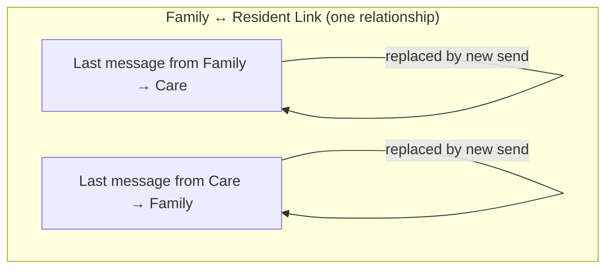
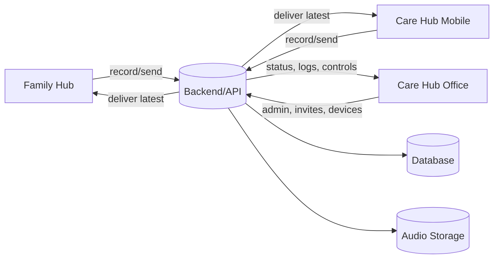
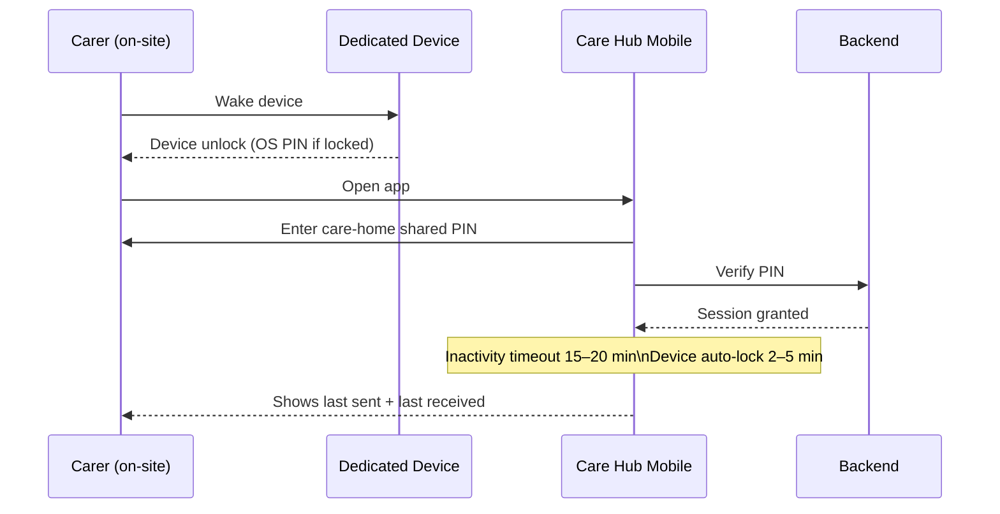
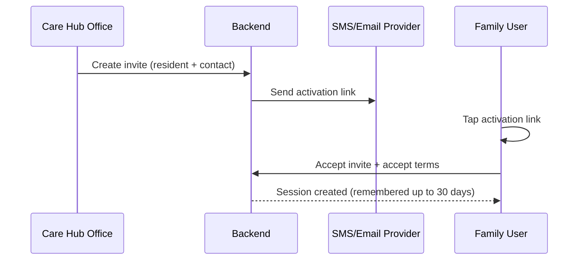
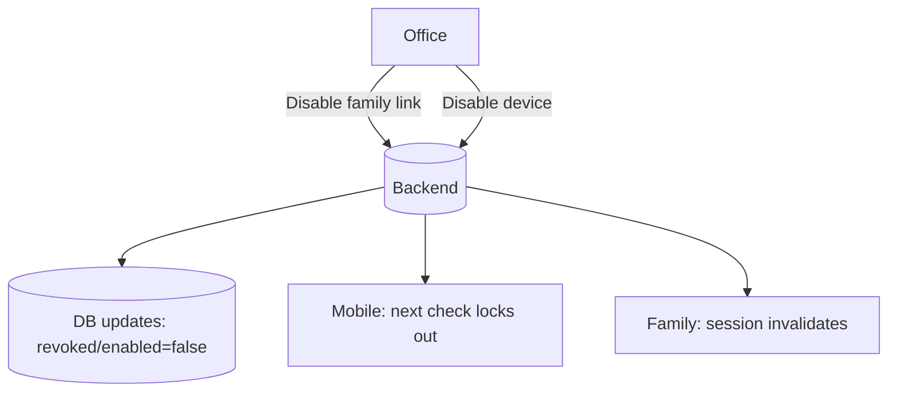
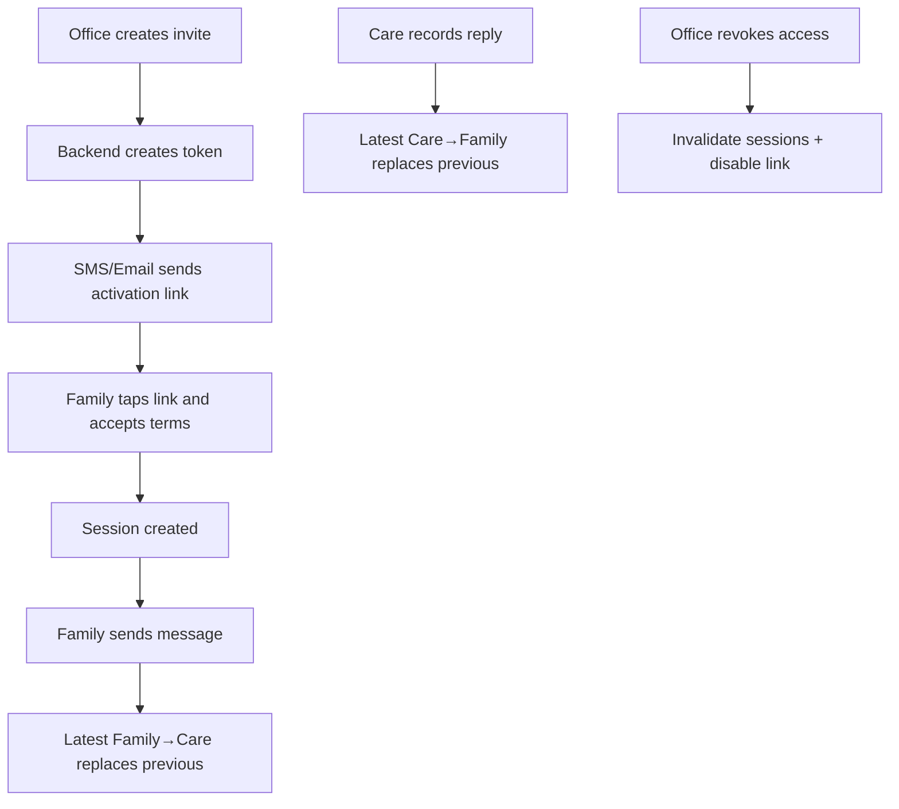
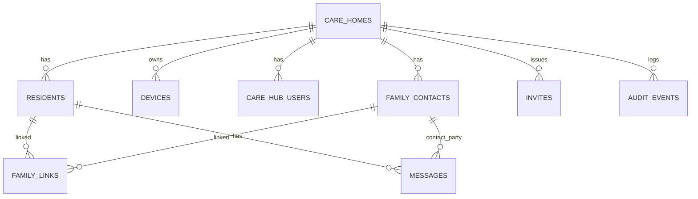

# Voice Message — Master System Plan
Finalised: 2026-02-22

## 0. How to use this document
This is the single reference document for how Voice Message works. It is designed to be readable end-to-end and to prevent decision drift. If something is unclear elsewhere, this file is the source of truth.

## 1. Purpose and philosophy
Voice Message is a low-urgency, social communication tool between families and care homes.
It is not clinical records, medication management, finance, or emergency messaging.
The design goal is calm usability and adoption. Security is proportionate and low-friction.

## 2. Product variants
- Family (end user)
- Care Hub — Mobile (carers on dedicated devices)
- Care Hub — Office (admin, onboarding, control)

## 3. Core constraint: Two-message model
Every interface shows only:
- Last message sent
- Last message received
No threads.

## 4. System overview diagram

## 5. Boundaries: what it is / what it is not
### 5.1 What it is

A calm, constrained channel for short social voice messages.

Designed to reduce pressure and remove “reply anxiety”.

### 5.2 What it is not

No urgent clinical info

No threaded chat

No archive browsing

No export tools

## 6. Roles and responsibilities

Care home staff use Mobile for recording/playing.

Office users control onboarding, invites, revocation, devices.

Families receive/send within strict limits.

## 7. Devices (non-negotiable)

Dedicated devices provided for Voice Message only.

No personal phones.

Devices remain on-site.

OS auto-lock: 2–5 minutes.

OS device PIN is enabled.

## 8. Authentication and access control
### 8.1 Care Hub Mobile: shared care-home PIN (final decision)

One shared 4-digit PIN per care home (hashed; changeable in Office).

Inactivity timeout: 15–20 minutes (re-enter PIN).

Primary protections are device control + no export + remote disable.

### 8.2 Care Hub Office: accounts + TOTP 2FA

Office uses individual accounts.

Office requires TOTP MFA.

Office holds all sensitive controls (invites, revocation, device disable).

### 8.3 Family: 30-day remembered session + magic link fallback

Family activates via invite link.

Family session persists up to 30 days for usability.

If logged out/new device: request magic link by SMS/email.

## 9. Family onboarding (invite-based self-activation)
### 9.1 Invite creation (Office)

Office creates invite: resident + family contact (SMS/email).

### 9.2 Activation (Family)

Family taps activation link, accepts terms, session created.

### 9.3 Revocation

Office can revoke family access instantly; sessions invalidate immediately.

## 10. Message lifecycle
### 10.1 Family → Care

When family records a new message, it replaces prior family→care message for that link.

UI shows only “last sent”.

### 10.2 Care → Family

When care records a new message, it replaces prior care→family message for that link.

UI shows only “last received”.

### 10.3 Storage & caching

No bulk export.

Avoid permanent device storage; stream or short-lived cache.

## 11. Screen behaviour by app
### 11.1 Family UI (must show two tiles)

Last message sent (playback)

Last message received (playback)

Record new message (replaces last sent)

### 11.2 Mobile UI

Same: last sent + last received

Record/Play only; no archive.

### 11.3 Office UI

Same two messages per link

Admin controls: invites, revoke, device disable, settings.

## 12. Data model overview (high-level)

(Placeholder for tables/entities: care_homes, residents, family_links, devices, messages, invites, audit_events)

## 13. Security model (proportionate)

Key controls:

Dedicated devices only

OS auto-lock + device PIN

Shared mobile PIN + inactivity timeout

No export/bulk history

Remote device disable

Office MFA

## 14. Audit and logs (minimal and non-creepy)

Log only what is needed to support trust and incident resolution:

invite_sent / invite_accepted / access_revoked

device_disabled

message_recorded (optionally without content metadata)

## 15. Incident handling (runbook)

Lost device: disable device in Office (immediate lockout).

Wrong family invited: revoke link, resend correct invite.

Complaint: disable link, review basic audit events.

## 16. Pilot rollout plan (bite-sized)

Self-test end-to-end on dedicated devices.

Friendly family test.

Single care home pilot (one unit, short window).

Expand only after stability.

## 17. Future phases (explicitly not now)

Individual carer attribution

NFC badges

Advanced analytics

Threaded history

## 18. Change log

2026-02-22 Created master plan document.

## Visual Appendix (3-diagram quick view)

### A) Map (system context)

### B) Flow (invite → activate → message → revoke)

### C) Entities (high-level data model)

