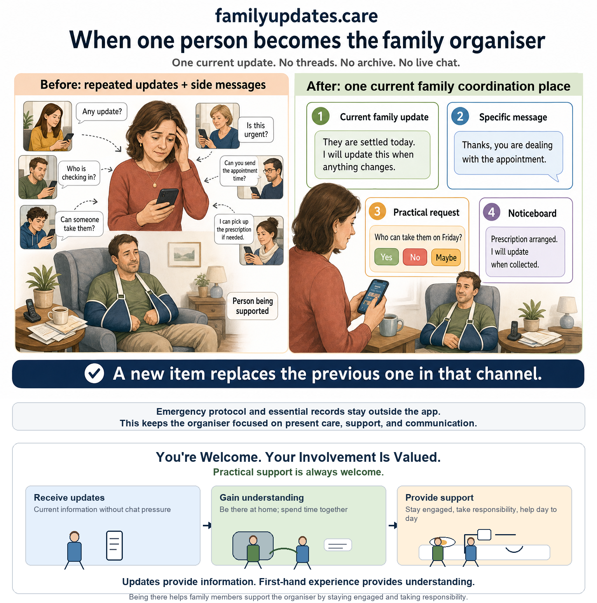



familyupdates.care helps structure communication when someone needs support and one family member or trusted friend has become the organiser.

It is for moments when a person becomes temporarily or permanently unable to manage part of their own life, for example elderly parent support, dementia, serious illness, recovery after surgery, stroke, accident or injury, temporary incapacity, long-term disability, mental health crisis, or another situation where family and friends need to coordinate around one person.

There are three roles for the family to fill:

1. Family Organiser.
2. Person available for urgent/emergency phone contact and emergency protocol.
3. Care support.

familyupdates.care keeps communication current, and as in real life conversation there are no threads or stored history, just one message at a time.

Families use the app for non-urgent support management: structured requests, updates, noticeboard-style information, and simple current messages. The Family Organiser gets the app, introduces it to Family Members, and may choose to tell the family when and how frequently they will check messages.

familyupdates.care does not remove the need for care, support, or professional help. But where repeated updates, questions, and practical coordination are adding to the organiser's strain, it can help by making communication calmer, more current, and more bounded.

Where someone else is helping with practical support, Mobile Support gives that person a simpler way to share quick updates or practical requests.

## What the app does

- One current update from the Family Organiser to the family group.
- One current specific message each way between the Family Organiser and each Family Member.
- One current update/request each way between the Family Organiser and Mobile Support, if required.
- One practical request from the Family Organiser, with structured responses from Family Members.
- One current noticeboard note from each Family Member, visible to the family group.

Each person's new message replaces their own previous message in that channel. One sender does not overwrite another sender's message. There are no threads, no archive, and no live chat.

The Family Organiser is not agreeing to be available all the time, solve everything, or act as everyone's private messenger. The Family Organiser is offering to keep a small number of family communication channels current. The general update is not a discussion thread and does not take direct replies.

familyupdates.care is for situations where communication structure is needed to help the Family Organiser provide essential support to a family member or friend.

## Where the app may be used

There are two settings: at home, and care home.

**At home** - The person is at home and a Family Organiser is using the app to help provide essential support, family communication, and life-admin structure. The organiser is usually hands-on too. If another person is also providing practical support, paid or unpaid, Mobile Support can be used by that person to share quick updates or practical requests.

**Care home** - The person is living in a care home, but family organisation continues. The care home handles care operations. familyupdates.care handles family-side non-urgent focussed communications where needed. If another person is also providing family-side practical support, paid or unpaid, Mobile Support can be used by that person.

## Family Organiser

A Family Organiser is the family member or trusted friend who introduces the app and helps keep essential support, family communication, and life admin structured. They are usually hands-on too. They may send updates, ask simple structured questions, and help reduce repeated calls, texts, and questions across the family. The role does not give legal authority by itself.

## Not for urgent matters

familyupdates.care is non-urgent and not live. Requests and structured replies are for non-urgent, non-essential coordination only.

Family requests remain visible to all linked Family Members and may specify that a message is relevant to a named person - but is viewable by all. All linked Family Members can see the request and any structured responses.

Family Members may reply to requests using fixed structured choices, optional fixed tick-boxes, and an optional short context note. There are no private chats, threads, or back-and-forth conversations.

Where enabled, Family Members may add one current family noticeboard note for simple practical coordination. Noticeboard notes are visible to linked Family Members and the relevant Office workspace. They are not private messages.

For essential, urgent, sensitive, medical, safeguarding, privacy-related, or time-critical matters, use normal direct communication outside familyupdates.care, such as phone, text, WhatsApp, email, or existing care/support routes.

The Family Organiser does not hold essential data or the emergency protocol inside familyupdates.care. Those arrangements are managed separately by the family so the organiser can focus on present care, support, and communication.

## Starting simply

### Getting organised

In preparation for using the app, your external filing system should be organised and for data security use your own secure file management and storage system. The information should be organised, separated, and accessible to the right person when needed. The six files we recommend that you prepare are:

- Life Log
- Contacts
- Admin and Key Documents
- Private Finance
- Private Health Notes
- Carer and Housekeeping Notes

You may also want to consider Lasting Powers of Attorney for property and financial affairs, and for health and welfare. Where finances, investments, or legal authority are involved, consider suitable legal or financial advice.

Once the external filing system is in place, start small: one calm update to registered Family Members. There are no replies in that update channel, no thread, and the next update replaces the previous one.

Then add only the communication tools that are useful: specific organiser messages to individual Family Members, practical requests, family noticeboard notes, and structured replies.
