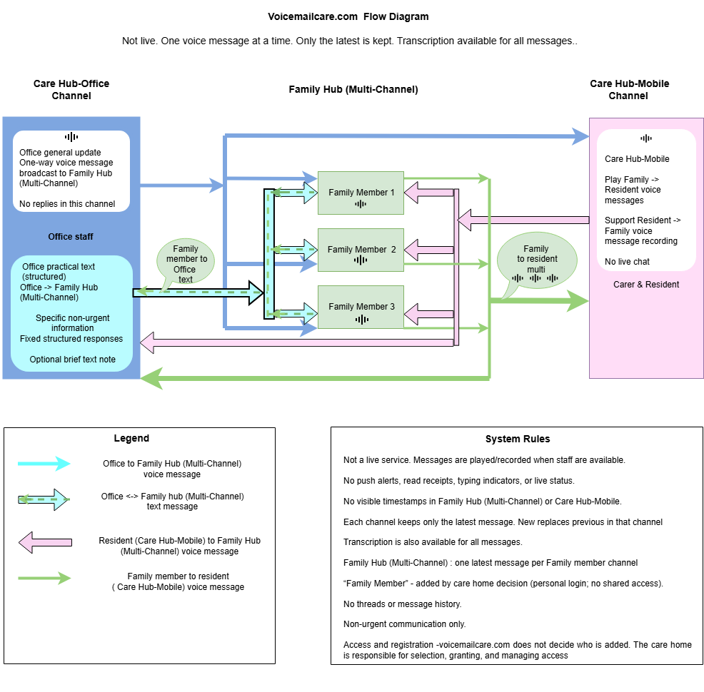

# Public Q&A

Communication participants: residents, Family Members, and Care Hub (Office and Mobile).

## What is voicemailcare.com for?

Non-urgent social voice messaging between residents and Family Members, plus non-urgent Office communication to family.

## Is this a live chat?

No. It is not live messaging.

## How many app interfaces are there?

Three: Family Hub, Care Hub - Mobile, and Care Hub - Office.

## What is an Office general update?

A one-way Office message broadcast to all Family Members for non-urgent general information.

## Can family reply to Office messages?

Family can reply to an Office practical message using a structured response form (Yes / No / Maybe, optional tick-boxes, optional short note).

## Is an Office practical message a chat thread?

No. It is a structured reply to one Office message, not open chat.

## Why do old messages disappear?

Each channel keeps only the latest message. A new message replaces the previous message in that channel.

## Can transcripts be provided?

Yes. A transcript can be requested when recording in Family Hub, Care Hub - Mobile, and Care Hub - Office.
When available, it appears under "Transcript assist" for the current message.

## Does the service show message history?

No archive and no scrolling thread.

## Do I get delivery/read notifications?

No. There are no live notifications, delivery confirmations, or read receipts.

## Are timestamps shown in the app?

Message date is shown in Family Hub and Care Hub - Mobile (date only, no time).

## Is this suitable for urgent or medical matters?

No. For urgent, medical, safeguarding, or emergency matters, contact the care home directly.

