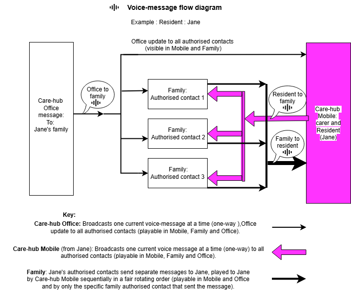

# Care Hub - Mobile training and instructions

Example: Jane

This diagram shows how voice messages and updates are organised for a single resident, using Jane as the example. Each authorised contact has their own contact channel for Family/Friend -> Resident messages. Care Hub – Mobile plays these family messages in a fair rotating order, with unplayed messages first.

Resident -> Family is one shared current message to all authorised contacts. The care home can also send a one-way Office update to all authorised contacts. In each channel/direction, only one current message is kept at a time, and a new message replaces the previous one.

## Who this is for

This guide is for care staff using Care Hub - Mobile during day-to-day resident support.

## What this app is for

- Non-urgent social voice messaging only
- One message in. One message out.
- Not live messaging

## Message flow and control

## Resident and Family messages

- Play the latest family messages for the resident in the app's fair rotating order (unplayed first).
- Record and send one shared current resident message to all authorised contacts.
- A new message replaces the previous message in that same direction.

## Office update (read-only in Mobile)

- Mobile users can play the latest Office update.
- Mobile users cannot edit, delete, or replace the Office update.

## Contact labels and message order

- Relationship labels (for example: daughter, son, spouse, friend) help staff identify each authorised contact.
- Family messages are played in a fair rotating order, with unplayed messages first.

## Important boundaries

- This is not an emergency or urgent service.
- Do not use this channel for clinical, medication, appointment, or safeguarding content.
- For those matters, follow normal care home escalation routes.
