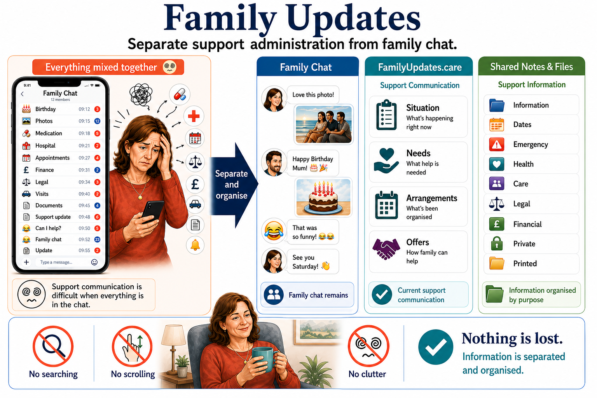

# familyupdates.care infographic

[Editable Markdown version](familyupdates_markdown_infographic.md)

## Updated infographic direction

### Panel 1

A normal family messaging group with everything mixed together: updates, questions, opinions, arrangements, documents, medical information, emergency information, legal information, financial information, photos, and family chat.

Caption: Communication becomes difficult when communication is used as a filing system.

### Panel 2

Support-related information is removed from the chat and filed appropriately:

- Emergency protocol
- Dates
- Family facts
- Carer quick reference
- Health documents
- Care documents
- Legal documents
- Financial documents
- Private documents
- Printed backup folder

### Panel 3

Usual messaging apps remain available for normal family chat.

### Panel 4

Family Updates handles only:

- current situation
- current needs
- current arrangements
- current offers of help

### Panel 5

Result:

- Clear communication
- Organised information
- Reduced organiser burden

Key message: Family Updates does not remove information. It removes clutter by separating communication from information.

Dates sit in Shared Notes / Notes & Files as owner-maintained reference items, not as a Family Office calendar.
